# NoteMind AI Backend Documentation

Welcome to the backend developer documentation for the **NoteMind AI** study assistant browser extension. 

NoteMind AI is designed to stream educational videos, perform high-fidelity local speech-to-text transcriptions, structure notes into markdown and hierarchical components, track notes visually by extracting video stream frames, synthesize rolling lecture summaries, and offer conversational search (RAG) over the processed material.

---

## 1. Overview

The backend is built as a TypeScript Node.js application, utilizing Socket.IO for real-time bi-directional streaming control, Redis as an active message queue and cache, and MongoDB for persistent structured notes, session data, and vector embedding indices. It leverages LangChain and LangGraph for orchestrating generative AI workflows powered by Gemini.

---

## 2. System Architecture

The following diagram illustrates the lifecycle of a video processing and notes generation session:

```mermaid
sequenceDiagram
    autonumber
    actor User as Chrome Extension
    participant BS as Backend Socket Server
    participant W as Transcription Worker
    participant DB as MongoDB Database
    participant R as Redis Cache & Queue
    participant G as Gemini & LangGraph

    User->>BS: session:create (video URL & details)
    BS->>DB: Save session metadata (creating)
    BS->>R: Cache session status & progress
    BS-->>User: Return session ID

    User->>BS: audio:download_started
    Note over BS: Spawn yt-dlp & pipe output to ffmpeg
    BS->>R: Push audio chunks to sorted queue (audio_queue:sessionId)
    BS->>User: Emit audio:chunking_completed

    loop Paced Transcription Loop
        User->>BS: transcript:next_chunk
        BS->>R: zpopmin next chunk path
        BS->>W: Spawn Worker thread to run local Whisper model
        W-->>BS: Returns transcript text
        BS->>R: Save state to context:sessionId
        BS->>G: Invoke LangGraph Agentic Pipeline
        
        rect rgb(30, 25, 50)
            Note over G: stateLoaderNode -> Load context from Redis
            Note over G: notesAgentNode -> Gemini creates structured notes
            opt Lecturer references visuals
                G->>BS: Call getFrame tool
                BS->>BS: Stream frame from video via yt-dlp + ffmpeg
                BS-->>G: Base64 JPEG frame data
            end
            G->>DB: sendAndsaveNode -> Append notes to DB
            G->>BS: sendAndsaveNode -> Emit notes:chunk_ready
            G->>R: summaryAgentNode -> Update & save rollingSummary
            G->>R: updateWindowNode -> Update sliding window list
            G->>DB: embeddingNode (if sliding window is full) -> Create & save vector embeddings
        end

        BS-->>User: Emit notes:chunk_ready
        User-->>User: Render notes and trigger next chunk request
    end
```



### Tech Stack
- **Runtime**: Node.js (with `tsx` watcher during development, compiled via `tsc`).
- **Core Server Framework**: Express and Socket.IO.
- **Databases**: MongoDB (for persistence & Atlas Vector Search) and Redis (for queueing, caching, and state management).
- **AI/LLM orchestration**: LangChain Core, LangGraph for state management, Gemini models for generation/embeddings.
- **Local Audio Inference**: Hugging Face Transformers.js (Whisper community model) running on worker threads.
- **Audio Extraction**: Native processes of `yt-dlp` and `ffmpeg`.

---

## 3. Core Pipelines & Services

### Audio Processing (yt-dlp & ffmpeg)
Located in [src/utils/audio_chunk.ts](file:///c:/Users/dell/OneDrive/Desktop/study%20extension/backend/src/utils/audio_chunk.ts) and [src/utils/load_audio.ts](file:///c:/Users/dell/OneDrive/Desktop/study%20extension/backend/src/utils/load_audio.ts):
- Streams audio dynamically from video URLs using `yt-dlp` (extracts best audio stream, defaults to Opus, output piped directly).
- Pipes stdout of `yt-dlp` directly into `ffmpeg`'s stdin.
- `ffmpeg` partitions the audio on-the-fly into uniform chunks (defaulting to 30 seconds) formatted as 16kHz, mono-channel, 16-bit PCM WAV segments under `./cache/${sessionId}/%04d.wav`.

### Speech-to-Text (Whisper Local Inference)
Located in [src/utils/whisper.ts](file:///c:/Users/dell/OneDrive/Desktop/study%20extension/backend/src/utils/whisper.ts), [src/utils/audio_transcription.ts](file:///c:/Users/dell/OneDrive/Desktop/study%20extension/backend/src/utils/audio_transcription.ts), and [src/workers/chunk_worker.ts](file:///c:/Users/dell/OneDrive/Desktop/study%20extension/backend/src/workers/chunk_worker.ts):
- Transcriptions are processed sequentially to pace notes creation.
- A Node.js Worker Thread is spawned for every chunk (`chunk_worker.ts`) to avoid blocking the main event loop during heavy CPU inference.
- Utilizes Hugging Face Transformers.js v3 with `onnx-community/whisper-base` model.
- Converts raw WAV buffer bits to `Float32Array` samples, downmixes to mono if necessary, and feeds the transcriber pipeline.

### Multi-Agent LangGraph Workflow
Located in [src/agents/graph.ts](file:///c:/Users/dell/OneDrive/Desktop/study%20extension/backend/src/agents/graph.ts):
Manages the agentic state graph execution with the following nodes:
- **`stateLoaderNode`** ([src/agents/state_loader.ts](file:///c:/Users/dell/OneDrive/Desktop/study%20extension/backend/src/agents/state_loader.ts)): Loads context (current transcript chunk, previous chunk, rolling summary) from Redis.
- **`notesAgentNode`** ([src/agents/notes_agent.ts](file:///c:/Users/dell/OneDrive/Desktop/study%20extension/backend/src/agents/notes_agent.ts)): An LLM agent (Gemini) that compiles structured notes according to `NotesSchema`.
  - Configured with the **`getFrame`** tool ([src/agents/tools/image.ts](file:///c:/Users/dell/OneDrive/Desktop/study%20extension/backend/src/agents/tools/image.ts)). If the lecturer refers to on-screen items, `getFrame` calls `yt-dlp` to get direct stream URLs and `ffmpeg` to extract a base64 encoded frame directly from the video stream at that exact timestamp.
- **`summaryAgentNode`** ([src/agents/summaryAgent.ts](file:///c:/Users/dell/OneDrive/Desktop/study%20extension/backend/src/agents/summaryAgent.ts)): An LLM agent that integrates the newly generated notes into the existing rolling summary.
- **`sendAndsaveNode`** ([src/agents/store_in_db.ts](file:///c:/Users/dell/OneDrive/Desktop/study%20extension/backend/src/agents/store_in_db.ts)): Saves the generated notes chunk into the MongoDB `Notes` collection (appended to the session's array) and emits it to connected clients.
- **`updateWindowNode`** ([src/agents/embedding.ts](file:///c:/Users/dell/OneDrive/Desktop/study%20extension/backend/src/agents/embedding.ts)): Updates the sliding queue of notes (last 3 chunks) stored in Redis.
- **`embeddingNode`** ([src/agents/embedding.ts](file:///c:/Users/dell/OneDrive/Desktop/study%20extension/backend/src/agents/embedding.ts)): If the sliding window has accumulated 3 chunks, it merges their texts, generates a vector embedding via Gemini Embeddings API, and saves it in MongoDB's `Embeddings` collection.

### RAG Search Service (Atlas Vector Search)
Located in [src/agents/utils/search.ts](file:///c:/Users/dell/OneDrive/Desktop/study%20extension/backend/src/agents/utils/search.ts) and [src/webSockets/handlers/search_query.ts](file:///c:/Users/dell/OneDrive/Desktop/study%20extension/backend/src/webSockets/handlers/search_query.ts):
- A student can issue text queries over the processed lecture notes.
- The query is embedded, and MongoDB Atlas Vector Search (`$vectorSearch`) searches the `Embeddings` collection filtered by the user's `sessionId`.
- A RAG agent (`ragAgent`) utilizes the matched chunks to write a conversational, plain-text response that answers the user's question, along with metadata and similarity scores.

---

## 4. File Directory Structure

Here is the organization of the backend codebase:

```
backend/
├── cache/                            # Temporary local audio chunks (*.wav) grouped by sessionId
├── src/
│   ├── index.ts                      # Main entrypoint, HTTP Express server, and WebSocket starter
│   ├── auth/                         # Authentication logic placeholder
│   ├── configs/                      # Service configurations
│   │   ├── gemini.ts                 # ChatGoogle and GoogleGenerativeAIEmbeddings setup
│   │   ├── redis.ts                  # Redis client client connections and listeners
│   │   └── whisper_model.ts          # Whisper community model and pipeline loader
│   ├── database/                     # DB client connection
│   │   ├── collections.ts            # Collections getter helper (Notes, Sessions, Embeddings)
│   │   └── mongo.ts                  # MongoClient wrapper
│   ├── schmas/                       # Zod validation schemas and Typescript types
│   │   ├── notes_schema.ts           # Lecture structure schemas (Notes, Topics, NoteBlocks)
│   │   ├── session_schema.ts         # User session metadata and status schemas
│   │   ├── embedding_schema.ts       # Database layout for Vector Search
│   │   ├── transcript_chunk.ts       # Raw transcripts and payload shapes
│   │   └── user_schema.ts            # User authentication properties
│   ├── utils/                        # Core utilities
│   │   ├── audio_chunk.ts            # Runs video download, pipes, and segments audio chunks
│   │   ├── audio_transcription.ts    # Spawns transcription worker threads
│   │   ├── env.ts                    # Strongly-typed environment variables validation via Zod
│   │   ├── events.ts                 # Centralized Socket.IO events catalog
│   │   ├── load_audio.ts             # Spawns child process for yt-dlp
│   │   ├── logger.ts                 # Logger settings configured via Winston
│   │   └── whisper.ts                # Audio file preprocessing and local inference pipeline
│   ├── webSockets/                   # Real-time WebSocket handlers
│   │   ├── server.ts                 # Main Socket.io Server instance exporter
│   │   ├── connections.ts            # Connection listeners and global error wrappers
│   │   └── handlers/                 # Specific WebSocket event handlers
│   │       ├── audio_chunking.ts     # Handles download initialization events
│   │       ├── search_query.ts       # Processes RAG search questions
│   │       ├── sessions.ts           # Processes Session lifecycles (create, join, leave, end)
│   │       └── transcription.ts      # Orchestrates sequential chunk requests & triggers LangGraph
│   └── workers/
│       └── chunk_worker.ts           # Speech-to-Text CPU tasks offloaded to worker threads
├── tsconfig.json                     # Typescript configuration rules
├── package.json                      # Scripts and dependencies configurations
└── .env                              # Local environment configurations (private)
```

---

## 5. Websocket API Events Reference

NoteMind AI communicates primarily via WebSocket events. Below is a dictionary mapping events defined in [src/utils/events.ts](file:///c:/Users/dell/OneDrive/Desktop/study%20extension/backend/src/utils/events.ts):

| Event | Direction | Payload Shape / Types | Purpose |
|---|---|---|---|
| `session:create` | Client -> Server | `CreateSessionPayload` | Creates a new lecture session. |
| `session:join` | Client -> Server | `JoinSessionPayload` | Registers client to session rooms and returns notes if already created. |
| `session:leave` | Client -> Server | `LeaveSessionPayload` | Disconnects client and shifts session state to `paused`. |
| `session:update:progress` | Client -> Server | `UpdateProgressPayload` | Updates progress percentage in DB and Redis cache. |
| `session:update:status` | Client -> Server | `UpdateStatusPayload` | Updates current lifecycle status of the session. |
| `session:end` | Client -> Server | None | Cleans up session queue files and deletes cache folders. |
| `audio:download_started` | Client -> Server | `DownloadStartedPayload` | Starts the download and chunking of a YouTube video audio. |
| `audio:chunking_completed` | Server -> Client | Response Payload | Emitted to notify chunk processes finished and are queued in Redis. |
| `transcript:next_chunk` | Client -> Server | None | Requests the next audio chunk from queue to transcribe. |
| `transcript:completed` | Server -> Client | `{ message: string }` | Emitted when all queued chunks are successfully processed. |
| `notes:processing_started`| Server -> Client | None | Informs client that LLMs are currently processing notes. |
| `notes:chunk_ready` | Server -> Client | `{ notes, startAt, endAt }` | Emitted when the LangGraph pipeline completes, sending the formatted notes block. |
| `search:query` | Client -> Server | `{ query: string }` | Performs conversational semantic search. |
| `search:results` | Server -> Client | `{ success, answer, score, chunks }`| Sends RAG output and matching documents source context back. |
| `error` | Server -> Client | `{ success: false, message: string }`| General catch-all error payload. |

---

## 6. Data Models & Schema Reference

### Session Status Enum
The session progresses through the following states in [src/schmas/session_schema.ts](file:///c:/Users/dell/OneDrive/Desktop/study%20extension/backend/src/schmas/session_schema.ts):
1. `creating`: Session object is generated in MongoDB and cached in Redis.
2. `active`: Session is joined and active.
3. `paused`: Active socket client leaves or gets disconnected.
4. `ended`: Session is complete. Cache directories are deleted.
5. `failed`: Processing errors occurred.

### Notes Schema Layout
Stored in [src/schmas/notes_schema.ts](file:///c:/Users/dell/OneDrive/Desktop/study%20extension/backend/src/schmas/notes_schema.ts):
Notes are broken down chunk-by-chunk under a unified document structure:
- **`NotesSchema`**: Includes:
  - `chapter`: string (e.g. "Process Scheduling")
  - `chunkIndex`: integer (ordered sequence index)
  - `topics`: Array of:
    - `title`: string
    - `blocks`: Array of `NoteBlock` elements.
- **`NoteBlock`**: Includes:
  - `type`: Heading, paragraph, list, code, table, formula, callout, diagram, example, or quote.
  - `content` / `level` / `items` / `headers` / `rows` / `variant` / `format` / `title` (depending on the type of block).

---

## 7. Environment & Configuration

Environment configurations are parsed and validated strictly at startup using Zod in [src/utils/env.ts](file:///c:/Users/dell/OneDrive/Desktop/study%20extension/backend/src/utils/env.ts).

### Env Configuration Properties
Ensure these properties exist in your local `.env` file:

```ini
GOOGLE_API_KEY=AIzaSy...              # Google AI Studio API key
MODEL=gemini-2.5-flash                # Gemini model for LangGraph (default: gemini-3-flash-preview)
PORT=3001                             # Port the server listens on
MONGO_DB_URI=mongodb+srv://...       # MongoDB Connection String
MONGO_DB_NAME=notemind_db             # Database Name
EMBEDDING_MODEL=text-embedding-004    # Embedding model (default: gemini-embedding-2)
REDIS_HOST=127.0.0.1                  # Redis connection address
REDIS_PORT=6379                       # Redis port
CHUNK_SIZE=30                         # Splitting duration (in seconds, default: 30)
VECTOR_INDEX=vector_index             # Name of the Atlas Vector Search Index
```

---

## 8. Setup & Running Locally

### Prerequisites
1. **Node.js**: v18+ recommended.
2. **MongoDB**: A running instance (Atlas is recommended for Vector Search capabilities).
3. **Redis**: A running server (locally or on cloud).
4. **yt-dlp**: Installed globally on the host operating system path.
5. **ffmpeg**: Installed globally on the host operating system path.

### Installation & Run Commands
In the `backend` folder, execute:

```bash
# 1. Install dependencies
npm install

# 2. Setup your .env file
cp .env.example .env # Create and fill in variables

# 3. Start development server with tsx-watch
npm run dev

# 4. Compile TypeScript to JavaScript
npm run build

# 5. Run compiled production server
npm run start
```
