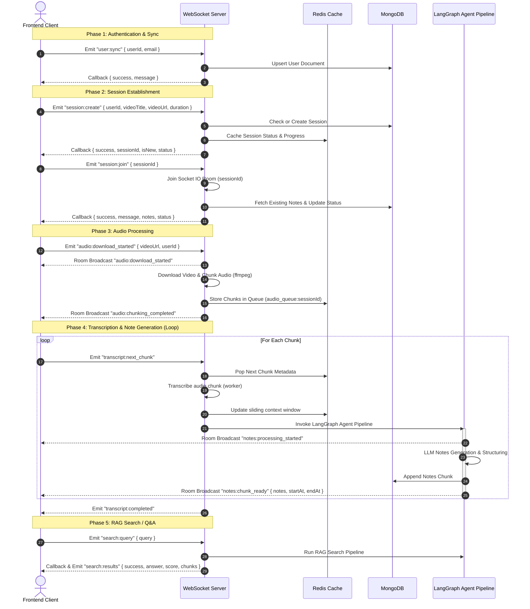

# Study Extension WebSockets Integration Guide

This guide outlines the WebSocket architecture, events, payload schemas, and flow of control between the Frontend (extension/web app) and the Backend.

---

## 📌 Protocol & Connection Details

- **Protocol**: WebSockets (via `socket.io`)
- **Default Port**: `3000` (`http://localhost:3000`)
- **Transport**: Websocket only (`transports: ["websocket"]`)
- **CORS Policy**: Allow all (`*`)

---

## 🔄 WebSocket Event Flow

This diagram illustrates the lifecycle of a study session, from connection to video transcription and search.



---

## ⚡ WebSocket Event Reference

> [!IMPORTANT]
> The server implements a global error wrapper for all event listeners. If a client-emitted event causes an unhandled error, the server will emit an `error` event to the socket instead of crashing.

---

### 👤 1. User & Authentication Sync

#### `user:sync`
- **Direction**: Client ➔ Server
- **Trigger**: Emitted immediately upon connection. Synchronizes client-side Auth0 or user identity with the database.
- **Payload**:
```json
{
  "userId": "string",
  "email": "string"
}
```
- **Expected Callback**:
```json
{
  "success": boolean,
  "message": "string"
}
```

---

### 📂 2. Session Management

#### `session:create`
- **Direction**: Client ➔ Server
- **Trigger**: Emitted when a user submits a video URL to start a study session.
- **Payload**:
```json
{
  "userId": "string",
  "videoTitle": "string",
  "videoUrl": "string",
  "duration": number // Video length in seconds
}
```
- **Expected Callback**:
```json
{
  "success": true,
  "sessionId": "string (16-char nanoid)",
  "isNew": boolean,
  "status": "creating" | "active" | "paused" | "ended" | "failed"
}
```
*or on error:*
```json
{
  "success": false,
  "message": "string (error details)"
}
```

#### `session:join`
- **Direction**: Client ➔ Server
- **Trigger**: Emitted after creating a session or navigating to an existing session page.
- **Payload**:
```json
{
  "sessionId": "string"
}
```
- **Expected Callback**:
```json
{
  "success": true,
  "message": "Joined session <sessionId>",
  "notes": Array<NoteChunk>, // Array of already generated note chapters/topics
  "status": "active"
}
```

#### `session:leave`
- **Direction**: Client ➔ Server
- **Trigger**: Emitted when the user closes the tab/extension or navigates away.
- **Payload**: `None`
- **Expected Callback**:
```json
{
  "success": true,
  "message": "Left session <sessionId>"
}
```
- **Backend Behavior**: The server leaves the socket room and changes the session status to `"paused"` in Redis and MongoDB.

#### `session:update:progress`
- **Direction**: Client ➔ Server
- **Trigger**: Emitted periodically during video playback to report current watch percentage.
- **Payload**:
```json
{
  "progress": number // Integer between 0 and 100
}
```
- **Expected Callback**:
```json
{
  "success": boolean,
  "message": "string"
}
```

#### `session:update:status`
- **Direction**: Client ➔ Server
- **Trigger**: Emitted to manually update session status (e.g. pause, resume).
- **Payload**:
```json
{
  "status": "creating" | "active" | "paused" | "ended" | "failed"
}
```
- **Expected Callback**:
```json
{
  "success": boolean,
  "message": "string"
}
```

#### `session:end`
- **Direction**: Client ➔ Server
- **Trigger**: Emitted when the user explicitly clicks "End Session" or completes the study.
- **Payload**: `None`
- **Expected Callback**:
```json
{
  "success": true,
  "message": "Ended session <sessionId>"
}
```
- **Backend Behavior**: Updates status to `"ended"` in Redis/DB, deletes the Redis audio queue and agent queues, and deletes the temporary filesystem audio cache folder (`cache/<sessionId>`).

---

### 🎙️ 3. Audio Processing

#### `audio:download_started`
- **Direction**: Bidirectional
  - **Client ➔ Server**: Trigger the download process on the backend.
  - **Server ➔ Room Broadcast**: Notify all clients in the room that downloading has begun.
- **Payload (from Client)**:
```json
{
  "videoUrl": "string",
  "userId": "string"
}
```
- **Broadcast Payload (from Server)**:
```json
{
  "success": boolean,
  "message": "string",
  "videoUrl": "string",
  "userId": "string"
}
```

#### `audio:chunking_completed`
- **Direction**: Server ➔ Client (Room Broadcast)
- **Trigger**: Emitted once the backend completes downloading and segmenting the video audio into WAV files.
- **Broadcast Payload**:
```json
{
  "success": true,
  "message": "Audio chunking completed for video: <videoUrl>",
  "videoUrl": "string",
  "userId": "string"
}
```

---

### 📝 4. Transcription & Notes Generation

#### `transcript:next_chunk`
- **Direction**: Client ➔ Server
- **Trigger**: Emitted sequentially by the frontend to request processing of the next audio chunk (usually triggered after receiving `audio:chunking_completed`).
- **Payload**: `None`
- **Expected Callback**: `None` (Process is event-driven; triggers broadcast events on progress)

#### `transcript:completed`
- **Direction**: Server ➔ Client
- **Trigger**: Emitted by the server during `transcript:next_chunk` when the queue of audio chunks is exhausted.
- **Payload**:
```json
{
  "message": "All audio chunks processed"
}
```

#### `notes:processing_started`
- **Direction**: Server ➔ Client (Room Broadcast)
- **Trigger**: Emitted immediately when the LangGraph agent begins note generation for a chunk.
- **Payload**: `None`

#### `notes:chunk_ready`
- **Direction**: Server ➔ Client (Room Broadcast)
- **Trigger**: Emitted when a chunk has been successfully transcribed, notes have been structured, and saved to the database.
- **Payload**:
```json
{
  "notes": {
    "chapter": "string",
    "chunkIndex": number,
    "topics": [
      {
        "title": "string",
        "blocks": Array<NoteBlock>
      }
    ]
  },
  "startAt": number, // start time in seconds
  "endAt": number    // end time in seconds
}
```

---

### 🔍 5. Interactive Q&A (RAG Search)

#### `search:query`
- **Direction**: Client ➔ Server
- **Trigger**: Emitted when a user asks a question about the session content.
- **Payload**:
```json
{
  "query": "string (1-512 chars)"
}
```
- **Expected Callback** & **`search:results`** Event:
```json
{
  "success": true,
  "answer": "string (RAG response answer)",
  "score": number, // match score
  "chunks": Array<SourceChunk>
}
```
*or on error:*
```json
{
  "success": false,
  "message": "string (error details)"
}
```

---

### ❌ 6. Global Error Event

#### `error`
- **Direction**: Server ➔ Client
- **Trigger**: Emitted if any WebSocket handler experiences an unhandled exception.
- **Payload**:
```json
{
  "success": false,
  "message": "string (error explanation)"
}
```

---

## 📌 Note Block Schema (Zod Definition)

Structured notes returned in `notes:chunk_ready` and `session:join` conform to the following schema. Use this to construct UI components for different note formats:

| Block Type | Fields Used | Description |
| :--- | :--- | :--- |
| `heading` | `content`, `level` | Standard header block (level 1-6) |
| `paragraph`| `content` | Regular paragraph |
| `list` | `items`, `style` | Bullet or numbered lists |
| `code` | `content`, `language` | Code snippets with syntax highlighting |
| `table` | `headers`, `rows` | Formatted markdown/tabular data |
| `formula` | `content` | LaTeX or math equations |
| `callout` | `content`, `variant` | Alerts/notes with variant `info`, `warning`, `tip`, `important` |
| `diagram` | `content`, `format` | Diagram source (e.g. `mermaid`, `svg`, `text`) |
| `example` | `content`, `title` | Real-world example code or illustration |
| `quote` | `content` | Blockquotes |

### JSON Example of a Structured Note:
```json
{
  "chapter": "Lecture 1: Introduction to Binary Search",
  "chunkIndex": 0,
  "topics": [
    {
      "title": "Core Algorithm",
      "blocks": [
        {
          "type": "paragraph",
          "content": "Binary search is an efficient algorithm for finding an item from a sorted list of items."
        },
        {
          "type": "code",
          "language": "typescript",
          "content": "function binarySearch(arr: number[], target: number) { ... }"
        },
        {
          "type": "callout",
          "variant": "tip",
          "content": "Make sure the input array is sorted before applying binary search!"
        }
      ]
    }
  ]
}
```
